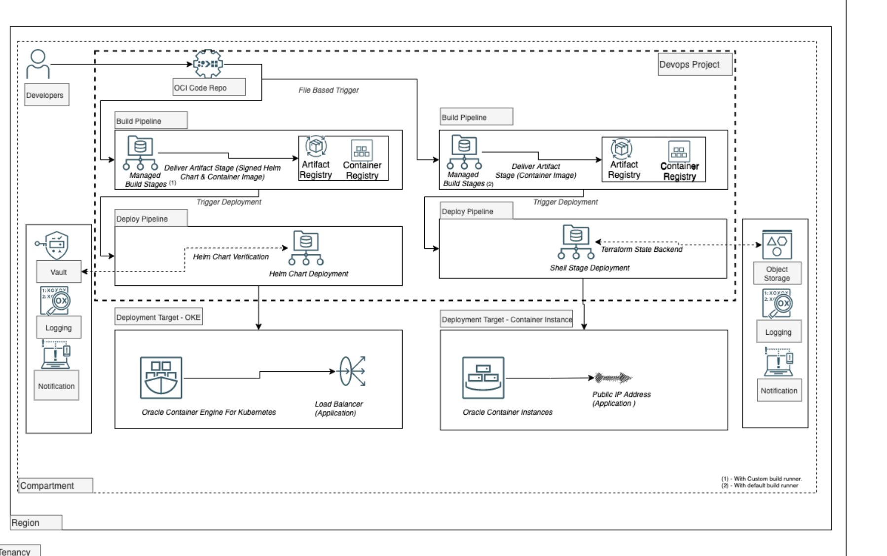

# terraform-oci-arch-devops-deploy-helm-and-ci

Rapid delivery of software is essential for efficiently running your applications in the cloud. Oracle DevOps service provides a continuous integration and deployment (CI/CD) platform for developers. You can use the DevOps service to easily build, test, and deploy software and applications on Oracle Cloud. DevOps build and deployment pipelines reduce change-driven errors and decrease the time customers spend on building and deploying releases. The service also provides a private Git repository to store your code and supports connections to external code repositories.

Whether you're migrating workloads to OCI (from on-premises or other clouds) or developing new applications on OCI, you can use the DevOps service to simplify your software delivery lifecycle!

In this reference architecture, we will be doing cloud-native application deployments using OCI DevOps.We will be using the Oracle container engine for Kubernetes (OKE) and OCI Container Instance as a deployment target for OCI DevOps.

- The Majors features covered in this Architecture are

    - Helm Chart Deployment with Provenance & Integrity checks: Signing a helm package and validating the integrity, by using GNU Privacy guard keys via deployment pipelines.
    - Using the Shell stage to deploy the application to the OCI Container instance. : Shell stage allows you to run custom commands in the deployment pipeline. This stage can be added at any point in the deployment pipeline. Here we will be using the stage to deploy an application to the OCI Container instance.
    - File-based trigger of OCI Build pipeline. : In Oracle Cloud Infrastructure (OCI) DevOps, a build run can be automatically triggered when you commit your changes to a code repository. Using this we can set the exclusion and inclusion of a set of files /folders against which the build pipelines execute during a code change.
    - Managed build stage using custom build runner. : Custom build runner allows to set desired OCPU and Memory for the build runner to support necessary resources for build instructions to run.
    - Using terraform with Remote state backend from OCI DevOps build pipeline. : The S3-compatible OCI Object storage bucket will be used as a remote backend to store the terraform states. The terraform will be executed from the OCI Build pipeline, which is enabled with resource principal so that the client can control the resource access based on policies.

##  Pictorial view of the architecture.




## Terraform Provider for Oracle Cloud Infrastructure
The OCI Terraform Provider is now available for automatic download through the Terraform Provider Registry.
For more information on how to get started view the [documentation](https://www.terraform.io/docs/providers/oci/index.html)
and [setup guide](https://www.terraform.io/docs/providers/oci/guides/version-3-upgrade.html).

* [Documentation](https://www.terraform.io/docs/providers/oci/index.html)
* [OCI forums](https://cloudcustomerconnect.oracle.com/resources/9c8fa8f96f/summary)
* [Github issues](https://github.com/terraform-providers/terraform-provider-oci/issues)
* [Troubleshooting](https://www.terraform.io/docs/providers/oci/guides/guides/troubleshooting.html)

## Deploy Using Oracle Resource Manager

1. Click [](https://cloud.oracle.com/resourcemanager/stacks/create?region=home&zipUrl=https://github.com/oracle-devrel/terraform-oci-arch-devops-deploy-helm-and-ci/releases/latest/download/terraform-oci-arch-devops-deploy-helm-and-ci-stack-latest.zip)

   If you aren't already signed in, when prompted, enter the tenancy and user credentials.

2. Review and accept the terms and conditions.

3. Select the region where you want to deploy the stack.

4. Follow the on-screen prompts and instructions to create the stack.

5. After creating the stack, click **Terraform Actions**, and select **Plan**.

6. Wait for the job to be completed, and review the plan.

   To make any changes, return to the Stack Details page, click **Edit Stack**, and make the required changes. Then, run the **Plan** action again.

7. If no further changes are necessary, return to the Stack Details page, click **Terraform Actions**, and select **Apply**.

### Validate the deployments.

#### Container instance deployment via Shell stage

- Use `OCI Console` > `Developer service` > `DevOps` > `Projects`>`Name of the project`.
- With `Devops Project Resources`>`Build pipeline` > `Pipeline named as <string>_build_containerinstance` > `Start Manual Run`
- Once all the build stages are completed, From `Devops Project Resources` > `Deployment pipelines`>`Select the pipeline named as deploy_containerinstance_<id>`.
- Check the deployments > Logs, and fetch the IP address for the application.
- A detailed instruction can be found [here.](https://github.com/oracle-devrel/oci-devops-examples/tree/main/oci-deployment-examples/oci-devops-deploy-containerinstance)

### Helm chart deployment with provenance and integrity

- Create a 'gpg key' for the helm chart. Ensure to use the same password as that provided during the resources manager or terraform.tfvars.
- Detailed instructions can be found [here.](https://github.com/oracle-devrel/oci-devops-examples/tree/main/oci-deployment-examples/oci-deployment-with-helm-attestation#gpg-key-setup-for-helm-signing-and-verification)
- Copy the `base64` formated public key to the vault > secrets > gpg_pub_key.
- Copy the private key to the OCI Artifact registry repo. Fetch its OCID.
- Use `OCI Console` > `Developer service` > `DevOps` > `Projects`>`Name of the project`.
- With `Devops Project Resources`>`Build pipeline` > `Pipeline named as <string>_build_helm`
- Update the build parameters GPG_ARTIFACT_OCID with the artifact's OCID.
- Update the build parameter HELM_SIGN_KEY with the `Name-Real` with the gpg-template.txt.
- Once all is done, do a manual build run. Follow its stages. Switch to the deployment pipeline for the helm.
- Follow the deployment jobs till it gets finished.
- Connect to the OKE Cluster and check for the load balancer created under the namespace, the default namespace is Default and the helm release name is ocidevops.


## Deploy Using the Terraform CLI

### Clone the Module

Now, you'll want a local copy of this repo. You can make that with the commands:

    git clone https://github.com/oracle-devrel/terraform-oci-arch-devops-cicd-with-functions
    cd terraform-oci-arch-devops-cicd-with-functions
    ls

### Prerequisites
First off, you'll need to do some pre-deploy setup.  That's all detailed [here](https://github.com/cloud-partners/oci-prerequisites).

Secondly, create a `terraform. tfvars` file and populate it with the following information:

```
# Authentication
tenancy_ocid         = "<tenancy_ocid>"
user_ocid            = "<user_ocid>"
fingerprint          = "<finger_print>"
private_key_path     = "<pem_private_key_path>"

# Region
region = "<oci_region>"

# Compartment
compartment_ocid = "<compartment_ocid>"

# OCI User and Authtoken
oci_user_name       = "<oci_username> 
# For a federated user (single sign-on with an identity provider), enter the username in the following format: TenancyName/Federation/UserName. 
# For example, if you use OCI's identity provider, your login would be, Acme/oracleidentitycloudservice/alice.jones@acme.com. 
#If you are using OCI's direct sign-in, enter the username in the following format: TenancyName/YourUserName. For example, Acme/alice_jones. Your password is the auth token you created previously.

oci_user_authtoken = "<oci_user_authtoken>" 
# You can get the auth token from your Profile menu -> click User Settings -> On left side  click *Auth Tokens -> Generate Token

# You can get the AWS Access Key and Its ID from your Profile menu -> click User Settings -> On the left side  click *Customer Secret Keys -> Generate Secret Key

#AWS_ACCESS_KEY_ID
aws_access_key_id = "***"
#AWS_SECRET_ACCESS_KEY
aws_access_key = "**="
````

Deploy:

    terraform init
    terraform plan
    terraform apply


### Validate the Deployment

#### Container instance deployment via Shell stage

- Use `OCI Console` > `Developer service` > `DevOps` > `Projects`>`Name of the project`.
- With `Devops Project Resources`>`Build pipeline` > `Pipeline named as <string>_build_containerinstance` > `Start Manual Run`
- Once all the build stages are completed, From `Devops Project Resources` > `Deployment pipelines`>`Select the pipeline named as deploy_containerinstance_<id>`.
- Check the deployments > Logs, and fetch the IP address for the application.
- A detailed instruction can be found [here.](https://github.com/oracle-devrel/oci-devops-examples/tree/main/oci-deployment-examples/oci-devops-deploy-containerinstance)

### Helm chart deployment with provenance and integrity

- Create a 'gpg key' for the helm chart. Ensure to use the same password as that provided during the resources manager or terraform.tfvars.
- Detailed instructions can be found [here.](https://github.com/oracle-devrel/oci-devops-examples/tree/main/oci-deployment-examples/oci-deployment-with-helm-attestation#gpg-key-setup-for-helm-signing-and-verification)
- Copy the `base64` formated public key to the vault > secrets > gpg_pub_key.
- Copy the private key to the OCI Artifact registry repo. Fetch its OCID.
- Use `OCI Console` > `Developer service` > `DevOps` > `Projects`>`Name of the project`.
- With `Devops Project Resources`>`Build pipeline` > `Pipeline named as <string>_build_helm`
- Update the build parameters GPG_ARTIFACT_OCID with the artifact's OCID.
- Update the build parameter HELM_SIGN_KEY with the `Name-Real` with the gpg-template.txt.
- Once all is done, do a manual build run. Follow its stages. Switch to the deployment pipeline for the helm.
- Follow the deployment jobs till it gets finished.
- Connect to the OKE Cluster and check for the load balancer created under the namespace, the default namespace is Default and the helm release name is ocidevops.

## Destroy the Deployment

Before initiating the destroy, ensure to clean all the resources that are created outside of terraform or resource manager actions.

- Clean all the artifacts from the artifact registry.
- Clean the objects from the object storage bucket.
- Delete the load balancer got created for helm deployment.
- OCI Vault will be deleted as part of terraform destroy, and validated before the execution.
- Once all set use  ``terraform destroy`` to delete the resources.

## Contributing
This project is open source.  Please submit your contributions by forking this repository and submitting a pull request!  Oracle appreciates any contributions that are made by the open-source community.

### Attribution & Credits
- Rahul M R (https://github.com/RahulMR42)

## License
Copyright (c) 2024 Oracle and/or its affiliates.
Licensed under the Universal Permissive License (UPL), Version 1.0.
See [LICENSE](LICENSE) for more details.

